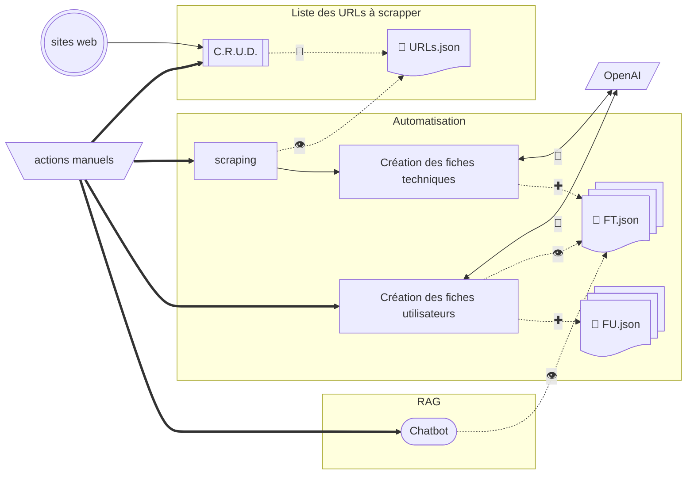
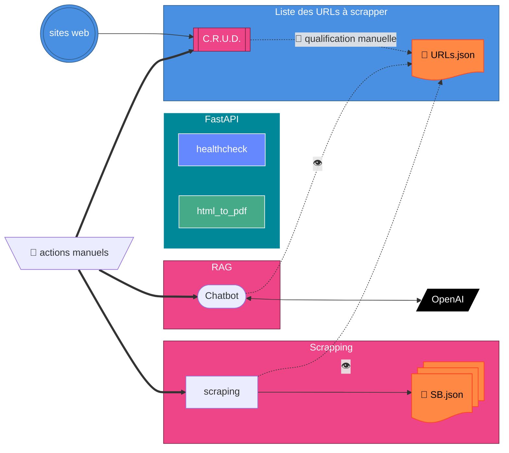

# 🧠 MÉMO INSTALLATION DOCKER + N8N (POC AWS EC2)

Ce guide permet de déployer rapidement **n8n** (version fixe) et **n9n** (version latest)

# 🧩 Résumé rapide
| Action | Commande |
|--------|----------|
| Lancer n8n | `docker compose up -d` |
| Lancer n9n | `docker compose --profile n9n up -d n9n` |
| Stopper tout | `docker compose down` |
| Mettre à jour | `docker compose pull && docker compose up -d` |
| Nettoyer images inutiles | `docker image prune -f` |

> 💡 Astuce :
>
> Si tu arrêtes ton instance EC2 (Stop), tout reste en place.
>
> Seule l’IP publique change, sauf si tu utilises une Elastic IP.

---
---
---

# PoCs
## PoC 1
> version avec enchainement de fiches et génération de pdf pour les collaborateurs


## PoC 2
> version avec scrapping des sources brutes + RAG


---
---
---

## 🛠️ Créer une instance 
> **AWS EC2 Ubuntu** toute neuve basé sur une instance EC2 ***t2.micro** à **t3.small** - ubuntu - allow http + https - key apir **n8npoc***.

**Lors de la création d'une instance EC2, choisir :**
* ubuntu
* **t2.micro** à **t3.small**
* créer ou utiliser une paire de clé
* "network settings" > EDIT
* Auto-assign public IP > Enable
* Subnet > utiliser un subnet public
 
**après création de l'instance**
* dans Security Groups
* supprimer les anciennes Rules et ajouter les rules suivantes :
* SSH port 22 sur 0.0.0.0/0
* HTTP port 80 sur 0.0.0.0/0
* HTTPS port 443 sur 0.0.0.0/0

## 💻 Commandes bash pour  l'installation de *Docker* 

### 🔹 1️⃣ Connexion SSH

```bash
ssh -i ~/.ssh/ta-cle.pem ubuntu@<IP-PUBLIQUE-EC2>
```

### 🔹 2️⃣ Créer l’arborescence projet

```bash
cd ~
mkdir -p ~/n8n/{n8n_data,n9n_data,n8n_files,n9n_files}
sudo chown -R 1000:1000 ~/n8n
sudo chmod -R 755 ~/n8n
cd ~/n8n
```


### 🔹 3️⃣ Installer Docker (méthode officielle)

```bash
sudo apt update
sudo apt install -y ca-certificates curl gnupg

sudo install -m 0755 -d /etc/apt/keyrings
curl -fsSL https://download.docker.com/linux/ubuntu/gpg | sudo gpg --dearmor -o /etc/apt/keyrings/docker.gpg
sudo chmod a+r /etc/apt/keyrings/docker.gpg

echo "deb [arch=$(dpkg --print-architecture) signed-by=/etc/apt/keyrings/docker.gpg] \
https://download.docker.com/linux/ubuntu $(. /etc/os-release && echo $VERSION_CODENAME) stable" | \
sudo tee /etc/apt/sources.list.d/docker.list > /dev/null

sudo apt update
sudo apt install -y docker-ce docker-ce-cli containerd.io docker-buildx-plugin docker-compose-plugin

sudo systemctl enable --now docker
```


### 🔹 4️⃣ Vérifier Docker + Compose

```bash
docker --version
docker compose version
```


### 🔹 5️⃣ Donner les droits à l’utilisateur ubuntu

```bash
sudo usermod -aG docker $USER
newgrp docker
```

Test :
```bash
docker ps
```


### 🔹 6️⃣ Créer ton fichier docker-compose.yml

Dans ~/n8n/docker-compose.yml :
```bash
services:
  n8n:
    image: n8nio/n8n:1.119.1
    container_name: n8n
    ports:
      - "443:5678"
    environment:
      - GENERIC_TIMEZONE=Europe/Paris
      - N8N_BASIC_AUTH_ACTIVE=true
      - N8N_BASIC_AUTH_USER=admin
      - N8N_BASIC_AUTH_PASSWORD=admin
      - N8N_SECURE_COOKIE=false
    volumes:
      - ./n8n_data:/home/node/.n8n
      - ./n8n_files:/files
    restart: unless-stopped

  n9n:
    image: n8nio/n8n:latest
    container_name: n9n
    profiles: ["n9n"]
    ports:
      - "5680:5678"
    environment:
      - GENERIC_TIMEZONE=Europe/Paris
      - N8N_BASIC_AUTH_ACTIVE=true
      - N8N_BASIC_AUTH_USER=admin
      - N8N_BASIC_AUTH_PASSWORD=admin
      - N8N_SECURE_COOKIE=false
    volumes:
      - ./n9n_data:/home/node/.n8n
      - ./n9n_files:/files
    restart: unless-stopped
```


### 🔹 7️⃣ Lancer ton environnement
▶️ Démarrer n8n (version fixe)
```bash
docker compose up -d
```

Accès :
> 👉 http://< IP-PUBLIQUE-EC2 >:5678

▶️ Démarrer n9n (version latest) à la demande
```bash
docker compose --profile n9n up -d n9n
```


Accès :
> 👉 http://< IP-PUBLIQUE-EC2 >:5680


### 🔹 8️⃣ Stopper proprement tous les conteneurs
```bash
docker compose down
```

ou (si tu veux aussi supprimer les volumes temporaires) :
```bash
docker compose down -v
```

### 🔹 9️⃣ Mettre à jour les images (notamment n9n)
```bash
docker compose pull
docker compose up -d
```


> 👉 Cela télécharge les nouvelles images (n8n:1.81.0 reste figée, n8n:latest se met à jour).


### 🔹 🔟 Nettoyer les anciennes images (optionnel)
```bash
docker image prune -f
```
